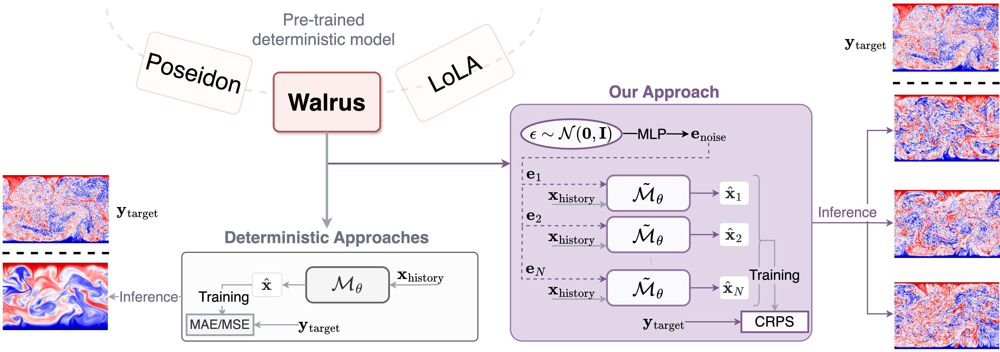

# Probabilistic Retrofitting of Learned Simulators - Lola

This repository contains the official implementation of the paper **Probabilistic Retrofitting of Learned Simulators**.

This codebase builds upon the [Lola codebase by PolymathicAI](https://github.com/PolymathicAI/lola). We have extended their framework with the necessary modifications to support CRPS (Continuous Ranked Probability Score) retrofitting, allowing deterministic learned simulators to be transformed into probabilistic models. It also includes implementations for baseline comparisons, including diffusion models and continued deterministic fine-tuning.

### Abstract
Dominant approaches for modelling Partial Differential Equations (PDEs) rely on deterministic predictions, yet many physical systems of interest are inherently chaotic and uncertain. While training probabilistic models from scratch is possible, it is computationally expensive and fails to leverage the significant resources already invested in high-performing deterministic backbones. In this work, we adopt a training-efficient strategy to transform pre-trained deterministic models into probabilistic ones via retrofitting with a proper scoring rule: the Continuous Ranked Probability Score (CRPS). Crucially, this approach is architecture-agnostic: it applies the same adaptation mechanism across distinct model backbones with minimal code modifications. The method proves highly effective across different scales of pre-training: for models trained on single dynamical systems, we achieve 20–54\% reductions in rollout CRPS and up to 30\% improvements in variance-normalised RMSE (VRMSE) relative to compute-matched deterministic fine-tuning. We further validate our approach on a PDE foundation model, trained on multiple systems and retrofitted on the dataset of interest, to show that our probabilistic adaptation yields an improvement of up to 40\%  in CRPS and up to 15\% in VRMSE compared to deterministic fine-tuning. Validated across diverse architectures and dynamics, our results show that probabilistic PDE modelling need not require retraining from scratch, but can be unlocked from existing deterministic backbones with modest additional training cost.


## Installation (using `uv`)

We highly recommend using [`uv`](https://github.com/astral-sh/uv), an extremely fast Python package installer and resolver written in Rust, to manage the environment for this repository.

**1. Install `uv` (if you haven't already):**

**On macOS and Linux:**
```bash
curl -LsSf https://astral.sh/uv/install.sh | sh
```

**On Windows:**
```bash
powershell -c "irm https://astral.sh/uv/install.ps1 | iex"
```

(Alternatively, you can install it via pip: `pip install uv`)

**2. Clone the repository:**
```bash
git clone https://github.com/...
cd [YourRepoName]
```

**3. Create a virtual environment and install dependencies:**
```bash
# Create a virtual environment named .venv
uv venv

# Activate the environment
# On macOS/Linux:
source .venv/bin/activate
# On Windows:
# .venv\Scripts\activate

# Install the dependencies
uv pip install -e .
```

## Repository Structure & Experiments
All scripts required to reproduce the experiments from the paper are located in the `experiments/` directory, and the configs in the `experiments/configs` directory.

### Data
We use three datasets (Euler, Rayleigh-Bénard, and Shear Flow). They can be downloaded from [The Well](https://github.com/PolymathicAI/the_well).

```bash
the-well-download --base-path ~/data/the_well --dataset euler_multi_quadrants_openBC
the-well-download --base-path ~/data/the_well --dataset euler_multi_quadrants_periodicBC
the-well-download --base-path ~/data/the_well --dataset rayleigh_benard
the-well-download --base-path ~/data/the_well --dataset shear_flow
```
These are big dataset, so this could take a while!

### Experiments

The [Lola codebase](https://github.com/PolymathicAI/lola?tab=readme-ov-file) offers instructions about how to obtain the deterministic emulators and the autoencoders for new datasets. We provide further instructions about how those can be used to be retrofitted into probabilistic models.

**1. CRPS Retrofitting / Training from Scratch**

The script that handles CRPS training is `train_crps.py` with the corresponding config file `train_crps.yaml`.

For retrofitting from a pre-trained deterministic surrogate, `load_surrogate` needs to be set to True.
- The pre-trained surrogate runpath can be specified in `surrogate_run`.
- Otherwise, the code will check for the pre-defined run paths for the three datasets we study in the paper: Euler, Rayleigh Benard, and Shear Flow. These will need changing depending on your setup.
```bash
python train_crps.py dataset=euler_all load_surrogate=True train.accumulation=4 staged_training.threshold_lr=3e-5 optim.learning_rate=1e-4
python train_crps.py dataset=rayleigh_benard load_surrogate=True train.accumulation=1 staged_training.threshold_lr=1e-4 optim.learning_rate=3e-4
python train_crps.py dataset=shear_flow load_surrogate=True train.accumulation=2 staged_training.threshold_lr=1e-4 optim.learning_rate=3e-3
```


For training from scratch, set `load_surrogate` to False.
```bash
python train_crps.py dataset=euler_all load_surrogate=False
python train_crps.py dataset=rayleigh_benard load_surrogate=False
python train_crps.py dataset=shear_flow load_surrogate=False
```

**2. Comparison to deterministic fine-tuning**

The `train_surrogate.py` script is used to compare with continued deterministic fine-tuning on a compute-matched budget. The config file for fine-tuning is `finetune_surrogate.yaml` and the commands to run the script are:
```bash
python train_surrogate.py dataset=euler_all finetune=True
python train_surrogate.py dataset=rayleigh_benard finetune=True
python train_surrogate.py dataset=shear_flow finetune=True
```
**3. Comparison to diffusion retrofitting**

Additionally, to compare with diffusion retrofitting we provide the `train_diffusion.py` script which should be run with `load_surrogate=True` for retrofitting.
```bash
python train_diffusion.py dataset=euler_all load_surrogate=True
python train_diffusion.py dataset=rayleigh_benard load_surrogate=True
python train_diffusion.py dataset=shear_flow load_surrogate=True
```

**4. Evaluation**

For evaluating the models, run the `eval.py` script. `eval_all.sh` contains the list of the main models presented in the paper.


**5. Scripts for obtaining models needed for the deterministic checkpoint**

The repo also contains the scripts necessary to obtain the deterministic surrogates. These are structured exactly as in the [Lola codebase](https://github.com/PolymathicAI/lola) and we refer to their [README file](https://github.com/PolymathicAI/lola?tab=readme-ov-file) for instructions on how to:
- train an autoencoder from scratch for a new dataset (using `train_ae.py`)
- cache the latent states once the autoencoder is trained for faster latent-space training (using `cache_latents.py`)
- train a latent-space deterministic emulator (using `train_surrogate.py` without the `finetune` flag), or a latent-space diffusion model (using `train_diffusion.py --load_surrogate=False`)

## Citation
Soon...

## Acknowledgements
We thank Géraud Krawezik and the Scientific Computing Core at the Flatiron Institute, a division of the Simons Foundation, for the compute facilities and support. Polymathic AI gratefully acknowledges funding from the Simons Foundation and Schmidt Sciences, LLC.